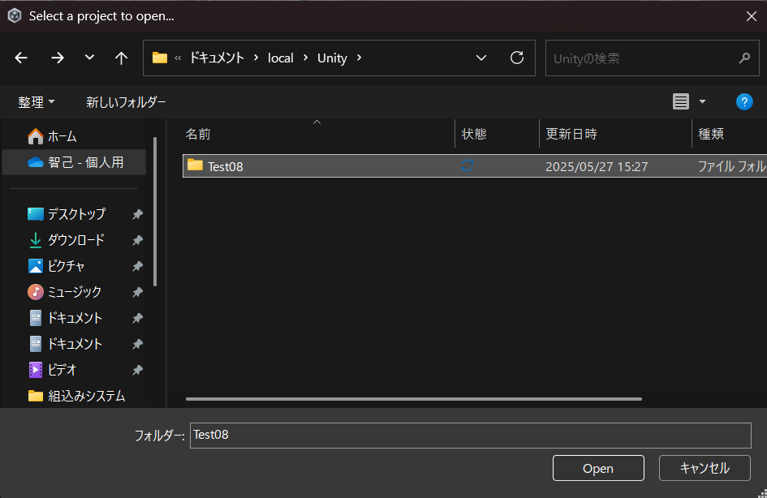
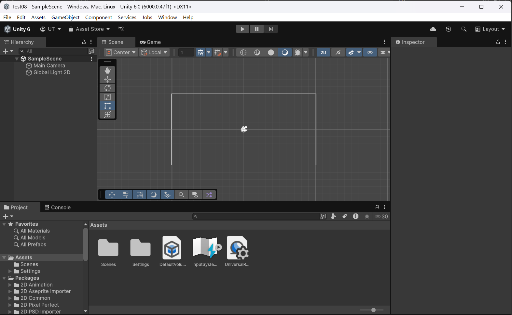

# Carcassonne

カルカソンヌガイドシステムの開発用

From 2025/05/06 ~ To 2025/07/22

## Set Up
### 前提条件

- Gitが導入済みであること．
- VSCodeが導入済みであること．

### 推奨

VSCodeで`Ctrl + @`でコマンドパレット（powershell）を開いて実行することを推奨します．  
（以下の画像は，VSCode上で行われるため．）

#### 1. `Ctrl + @`でpowershellを開き，`git clone`の実行


上記のような画面になるはずです．

#### 2. カレントディレクトリを`Carcassonne`にする．

コマンドパレットで以下を実行します．

```shell
cd Carcassonne
```

#### 3. `git remote add`の実行

コマンドパレットで以下を実行します．

```shell
git remote add origin https://github.com/AL23075/Carcassonne.git
git branch -M main
git push -u origin main
```


表示は違う可能性がありますが，コンソール出力を見てできているのか判断してください．


## gitコマンド
### git clone

このリポジトリをダウンロードしたいとき．

```shell
git clone https://github.com/AL23075/Carcassonne.git
```

これでできます．

### git remote add

このリポジトリで共同開発を行うとき．

```shell
git remote add origin https://github.com/AL23075/Carcassonne.git
git branch -M main
git push -u origin main
```

`git clone`->`git add remote`までやれば，セットアップは終了です．

### git add

変更を加えたすべてのファイルをgit上にあげたいとき．

```shell
git add .
```

特定のファイルだけgit上にあげたいとき．

```shell
git add <your-file-path>
```

`your-file-path`の部分は現在地からの相対パスでも絶対パスでもいいです．  
`<your-file-name>`の部分は適宜変えること．

### git reset HEAD

間違えて`git add`したとき．

```shell
git reset HEAD
```

これで，`git add`したファイルがすべて取り消されます．
特定のファイルのみを取り消したいときは，以下を実行すること．

```shell
git reset HEAD <your-file-path>
```

`your-file-path`の部分は現在地からの相対パスでも絶対パスでもいいです．  
`<your-file-name>`の部分は適宜変えること．

### git commit -m "comment"

`git add`した内容をcommit（皆が見れる状態）にしたいとき．

```shell
git commit -m "your-comment"
```

`your-comment`の部分は適宜変えること．  
できるだけ「どこを変更した」とか，「どこを直した」的なのを簡潔に書いてくれると助かります．

### git status

現在何が`add`されているのかやどのブランチにいるのか確かめたいとき．

```shell
git status
```

これで詳細が表示されます．

### git branch

現在いる`branch`名を確認できます．

```shell
git branch
```

### git checkout <branch-name>

`branch`を切り替えたいとき．

```shell
git checkout <branch-name>
```

これで`branch`の切り替えができます．  
`<branch-name>`の部分は適宜変えること．

### git checkout -b <branch-name>

`branch`を作成したいとき．

```shell
git checkout -b <branch-name>
```

これで`branch`の作成と切り替えが同時にできます．  
`<branch-name>`の部分は適宜変えること．  

### git push -u origin <branch-name>

`branch`にデータを登録したいとき．

初回
```shell
git push -u origin <branch-name>
```
`branch`を作成したら，ここまでやること．

2回目以降
```shell
git push
```

これでデータの登録ができます．  
`push`時の注意として，gitでデータが登録されるのはあくまでファイルです．ディレクトリではないので注意．

### git pull

リポジトリを最新の状態に更新したいとき．

```shell
git pull
```

これだけ．

## Project

`git clone`したプロジェクトが導入できたかのチェックです．  
必要に応じて，やってみてください．

### 1. UnityHubを開いて，`Add`->`Add project from disk`をクリック．


### 2. `git clone`したフォルダ`Carcassonne`を指定して「決定」．



### 3. プロジェクトフォルダに`Carcassonne`が追加されます．


### 4. プロジェクトを開くと，以下のような画面が表示されるはずです．



### 5. Assets/Scenes/SampleCubeを見てみる．


### 6. SampleCubeをダブルクリック．


### 7. 左上の`Cube`をクリックすると，右側にその情報が表示されます．


### 8. 動かしてみる．
上部に表示されている「▶」をクリックすると動きます．


## Contact

その他分からないことがあったら，`Issues`かSlackで連絡ください．
